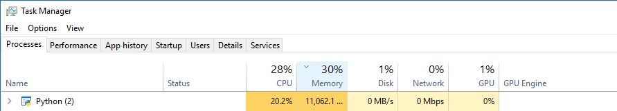
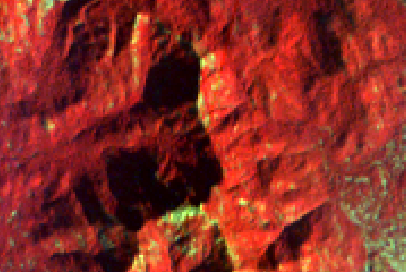

# Classification of Hyperion(EO-1)  Hyperspectral Satellite Data 

The EO-1 satellite is placed on a sun-synchronous orbit, at an altitude of 705 km. It is capable of imaging a 7.65 km swath, with a spatial resolution of 30m. It covers images of a spectral range of 0.4 - 2.5 µm in 242 spectral bands, with a spectral resolution of 10nm1. The hyperspectral imagery as given for the task has an area of interest is Greater Mumbai.

The given assignment has two main tasks:- 
<b>Analysis</b>:- to segment the hyperspectral imagery in different classes. 
<b>Visualization</b>:- Use the folium library to show map and for graphs

The hyperspectral imagery has 242 bands as we cannot use all of them as they may have a correlation with each other. So the high dimensionality of the dataset has been reduced with the help of PCA (Principal component analysis)2. It is a technique from linear algebra used to reduce the input variables storing redundant information. I have done this by using python library scikit-learn built on NumPy, SciPy, and matplotlib3. Further, I have used the K-means algorithm which is used to average the data to find the centroid. First, it will randomly select centroids, which are being used as the starting point for every cluster and iterate to a better position of the centroids. Then using these centroids it creates clusters of pixels to classify them. By using the KMeans function sklearn library the image was classified. The input for this is taken as the transformed array and number of clusters given by the user.

Geospatial Data Abstraction Library (GDAL) is used to manipulate spatial data such as a stacking of 242 images from gdal_merge function and the gdal_warp function for reprojecting the output tiff file to WGS84 spatial coordinate system from UTM to visualize it on the web map. The matplotlib library of python is used to visualize the image result of the K-means and by using the Elbow plot it explains the variance of 242 components. After executing PCA it reduced the number of components to 3 then I visualized variance using seaborn library4.  To better visualize the end result folium python library5 was used, Colormap was used to show each class with different colors6.

<b>Limitation</b>:
1. The first limitation is the system configuration as while computing PCA for this huge data the RAM which has been used is 12GB in idle. This requires high end systems for processing this hyperspectral data
</img> 

2. Second is topographic effects such as shadows of mountains also cause an error in classes as they appear dark and get merged with water classes. The solution to this is doing band rationing or using DEM to create hillshade and mask the shaded portion out.
 </img> 

The file named as map.html has a final output shown in the web map and in the Data_processing_EO_1.ipynb notebook file has all the processes. Also python file is attached for those who want to run the code from idle after installing libraries required.
 

 

<b>References</b>:-
1.	USGS EROS Archive - Earth Observing One (EO-1) Hyperion. https://www.usgs.gov/centers/eros/science/usgs-eros-archive-earth-observing-one-eo-1-hyperion?qt-science_center_objects=0#qt-science_center_objects.
2.	Senthilnath, J., Omkar, S. N., Mani, V., Karnwal, N. & Shreyas, P. B. Crop Stage Classification of Hyperspectral Data Using Unsupervised Techniques. IEEE Journal of Selected Topics in Applied Earth Observations and Remote Sensing vol. 6 861–866 (2013).
3.	scikit-learn: machine learning in Python — scikit-learn 0.23.1 documentation. https://scikit-learn.org/stable/.
4.	seaborn: statistical data visualization — seaborn 0.10.1 documentation. https://seaborn.pydata.org/.
5.	folium. PyPI https://pypi.org/project/folium/0.1.5/.
6.	branca.colormap — branca 0.4.0+6.g75abed2 documentation. https://python-visualization.github.io/branca/colormap.html

